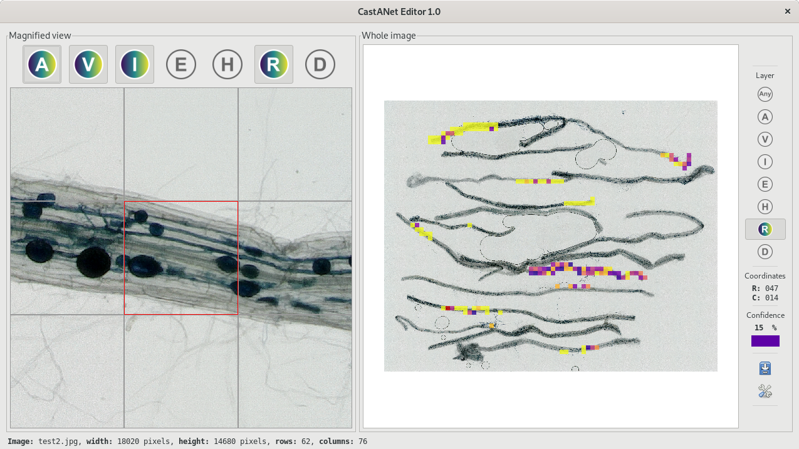

# CastANet Editor

Graphical user interface to assist with the annotation of mycorrhiza images.



## Installation instructions

### Installing OPAM

[OPAM](https://opam.ocaml.org/) is the OCaml package manager.

#### Linux

For Debian and relatives, install OPAM with [`apt`](https://salsa.debian.org/apt-team/apt).
For other distributions, check your favourite package manager.

```
apt install opam
```

#### OSX

Install OPAM with [`homebrew`](https://brew.sh/). Note that `homebrew` 
requires `gpatch`, as `opam` uses GNU-specific options.

```
brew install gpatch opam gtk+ cairo
```

#### MS Windows

You should first install the [Cygwin](https://www.cygwin.com/) packages:
git,wget,unzip,make,m4,gcc,gcc4-core,libmpfr4,autoconf,flexdll,libncurses-devel,
curl,ocaml,ocaml-compiler-libs,patch

Then you can build opam from sources as follows:

```
git clone https://github.com/ocaml/opam.git && cd opam
./configure && make && make install && cd ..
```


### Installing OCaml libraries

#### OPAM initialization

Simply run:

```
opam init
eval `opam config env`
```

### CastANet Dependencies

You need to install the following dependencies:

- The OCaml build system [`dune`](https://opam.ocaml.org/packages/dune/),
- The documentation generator [`odoc`](https://opam.ocaml.org/packages/odoc/),
- OCaml bindings to GTK2 library [`lablgtk`](https://opam.ocaml.org/packages/lablgtk/),
- OCaml bindings to Cairo libary [`cairo2`](https://opam.ocaml.org/packages/cairo2/)

This is done as follows:

```
$ opam install dune odoc lablgtk cairo2 cairo2-gtk
```

