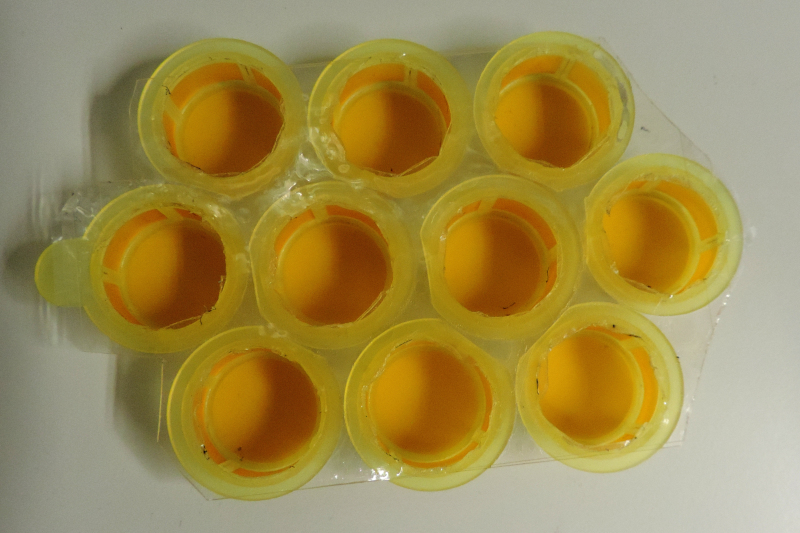
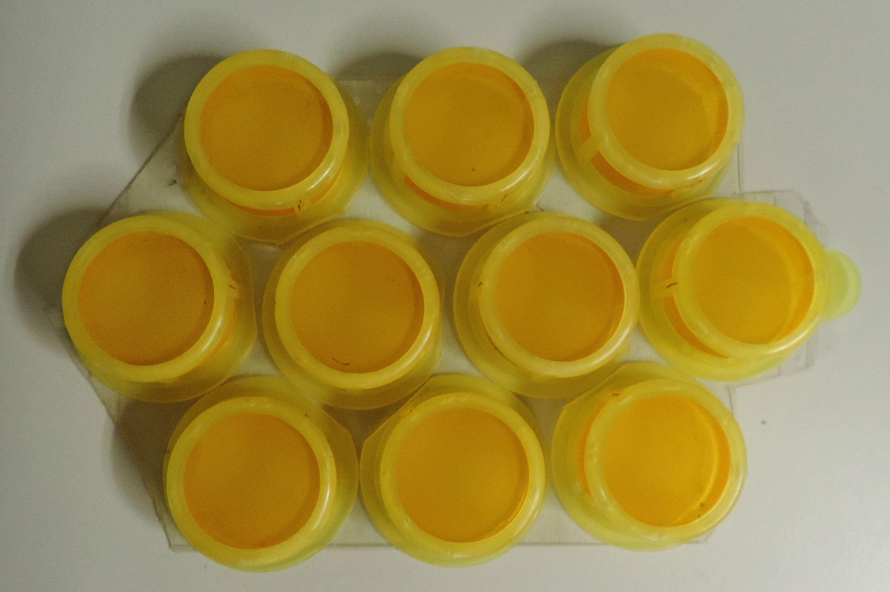
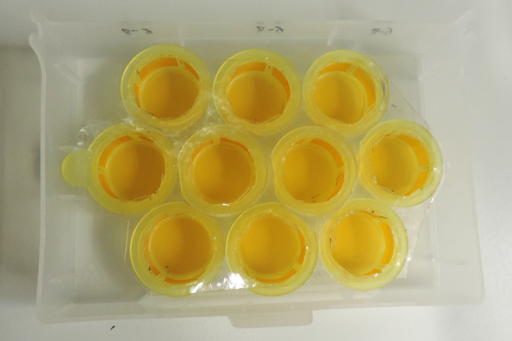

#  AMFinder               

The Automatic Mycorrhiza Finder (AMFinder) allows for automatic computer
vision-based identification and quantification of AM fungal colonisation
and intraradical hyphal structures on ink-stained root images using
convolutional neural networks. **The latest version of AMFinder is v2.0.**

If you use AMFinder, please cite [Evangelisti _et al._, 2021, _New Phytologist_](https://doi.org/10.1111/nph.17697).

**We would like to hear from you:** are you working with a system that appears challenging for AMFinder? Please get in touch! We would be happy to help generate specialised CNN1/2 networks and make them widely available to the research community.

## Summary

1. [Installation instructions](#install)
1. [Command-line tool `amf`](#amf)
2. [Standalone interface `amfbrowser`](#amfbrowser)
3. [A typical pipeline](#pipeline)
4. [How to batch stain plant roots?](#staining)

## Installation instructions<a name="install"></a>

Detailed installation instructions for Linux, Mac and Microsoft Windows can be found on [this page](INSTALL.md).

## Command-line tool `amf`<a name="amf"></a>

The command-line tool `amf` is used for the following tasks:
- `amf predict`: prediction of fungal colonisation (CNN1) and intraradical hyphal structures (CNN2), 
- `amf convert`: automatic conversion of predictions to annotations,
- `amf train`: neural network training.

### Prediction mode<a name="amfpred"></a>

**Important**: Remember to activate `amf` virtual environment before use (see installation instructions).

For predictions, run in a terminal `amf predict <parameters> <images>` where `<parameters>` are either the short or long names listed below. Replace `<images>` with the path to the JPEG or TIFF images to analyse.

|Short|Long|Description|Default value|
|-|-|-|-|
|`-net CNN`|`--network CNN`|**Mandatory**. Use network `CNN` (see list below).|
|`-t N`|`--tile_size N`|**Optional**. Use `N` pixels as tile size.|N = 126|

Pre-trained networks to be used with the parameter `-net` are available in folder [`trained_networks`](amf/trained_networks). You can add your own trained networks to this folder.

|File name|Annotation level|Description|
|-|-|-|
|[CNN1v1.h5](amf/trained_networks/CNN1v1.h5)</a>|CNN1|Ink-stained, ClearSee-treated root pictures (flatbed scanner/microscope).|
|[CNN1v2.h5](amf/trained_networks/CNN1v2.h5)|CNN1|Same, but trained with data augmentation.|
|[CNN2v1.h5](amf/trained_networks/CNN2v1.h5)|CNN2|Ink-stained, ClearSee-treated microscope root pictures.|
|[CNN2v2.h5](amf/trained_networks/CNN2v2.h5)|CNN2|Same, but trained with data augmentation.|

**Note:** the image datasets used to generate these trained networks are available on [Zenodo](https://doi.org/10.5281/zenodo.5118948).

### Conversion mode<a name="amfconv"></a>

**July 2022**: `amf` is now able to perform automatic conversion of computer predictions to annotations. **This is an experimental feature** (still under active development).

For automatic conversion of computer predictions to annotations, use `amf convert <images>`. At the moment, `amf` can only convert CNN1 predictions and does not support files containing multiple predictions. The program prints image names and counts for the classes Myc+ (colonised root sections), Myc− (non-colonised root sections), and Other (background, dust, etc.).


### Training mode

**Note:** To be able to run `amf`, you first need to reactivate the virtual environment by running the command `source amfenv/bin/activate` (see installation guidelines, step 4).

For training, run in a terminal `amf train <parameters> <images>` where `<parameters>` are either the short or long names listed below (all training parameters are optional). Replace `<images>` with the path to the JPEG or TIFF images to analyse.

|Short|Long|Description|Default value|
|-|-|-|-|
|`-net CNN`|`--network CNN`|Use network `CNN`.|*ab initio* training|
|`-b N`|`--batch_size N`|Use a batch size of `N` tiles.|N = 32|
|`-k`|`--keep_background`|Do not skip any background tile.|False|
|`-a`|`--data_augmentation`|Activate data augmentation.|False|
|`-s`|`--summary`|Save CNN architecture and graph.|False|
|`-o PATH`|`--outdir PATH`|Save trained model and CNN architecture in `PATH`.|cwd|
|`-e N`|`--epochs N`|Perform `N` training cycles.|N = 100|
|`-p N`|`--patience N`|Wait for `N` epochs before early stopping.|N = 12|
|`-lr X`|`--learning_rate X`|Use `X` as learning rate for the Adam optimiser.|X = 0.001|
|`-vf N`|`--validation_fraction N`|Use `N` percents of total tiles as validation set.|N = 15%|
|`-1`|`--CNN1`|Train for root colonisation.|True|
|`-2`|`--CNN2`|Train for intraradical hyphal structures.|False|


Training can benefit from high-performance computing (HPC) systems.
Below is a template script for [Slurm](https://slurm.schedmd.com/):

```
#! /bin/bash
#SBATCH -e <error_file>
#SBATCH -o <output_file>
#SBATCH --mem=<memory_GB>
#SBATCH -n <procs>

ROOT=/home/<user>/amf

source $ROOT/amfenv/bin/activate
$ROOT/amf train <parameters> <images>
deactivate
```

## Standalone interface `amfbrowser`<a name="amfbrowser"></a>

**Browse, amend and validate `amf` predictions.**


## A typical pipeline<a name="pipeline"></a>

*Make sure `amf` and `amfbrowser.exe` are in `$PATH` or use `/path/to/amf` and `/path/to/amfbrowser.exe` when typing the commands below.*

1. Predict colonisation on ink-stained root images: `amf predict -net your_CNN1.h5 *jpg`.

   **Note 1**: `amf` parameters can be found in [this section](#amfpred).
   
   **Note 2**: H5 files containing trained networks can be found in `trained_networks`. If you trained AMFinder on a specific dataset, copy/paste your custom H5 file to this folder. AMFinder won't use H5 files stored in other folders.
   
2. Convert computer predictions to annotations by running `amfbrowser.exe your_image.jpg` on each image. AMFinder is a semi-automatic prediction pipeline. User supervision and validation of computer predictions for fungal colonisation is required before intraradical hyphal structures can be analysed.

    **Important:** `amfbrowser` is a graphical interface. It won't run on a text-based system such as an HPC.

    **July 2022:** As an alternative, computer predictions can now be converted to annotations in batch mode using `amf convert <images>`. Please note that annotations should be checked with `amfbrowser`, especially when using new staining methods or imaging systems that may affect AMFinder performance.

3. Predict intraradical hyphal structures: `amf predict -net your_CNN2.h5 *jpg`.
4. Convert computer predictions to annotations by running `amfbrowser your_image.jpg` on each image.


## How to batch stain plant roots?<a name="staining"></a>

An optimised ink-staining protocol with additional clearing is available in [Evangelisti *et al.* (2021)](https://doi.org/10.1111/nph.17697).

**Batch staining plant roots is essential for high-throughput analyses.** It can be achieved using a hand-crafted device composed of 10 cell strainers (100 µm nylon mesh) tied together with adhesive sealing film for PCR plates. A single sieve can accommodate a 4-week-old *N. benthamiana* root system. The sieves containing roots are immersed in 10% KOH, water, or ink/vinegar staining solution poured in a plastic lid. Plastic lids are floated in a hot (95°C) water bath to achieve the desired staining conditions. Sieves are pulled out of the lid containing the KOH solution and transferred to the washing solution, then to the ink staining solution without the need to manipulate roots, thereby reducing the risk of damage.

|View from above|View from below|With plastic lid|
|-|-|-|
|||

Credit: devices from Dr [Albin Teulet](https://twitter.com/albinteulet) and [Alex Guyon](https://twitter.com/alexwguyon) (Schornack lab), derived from an original idea by Dr Clément Quan.
